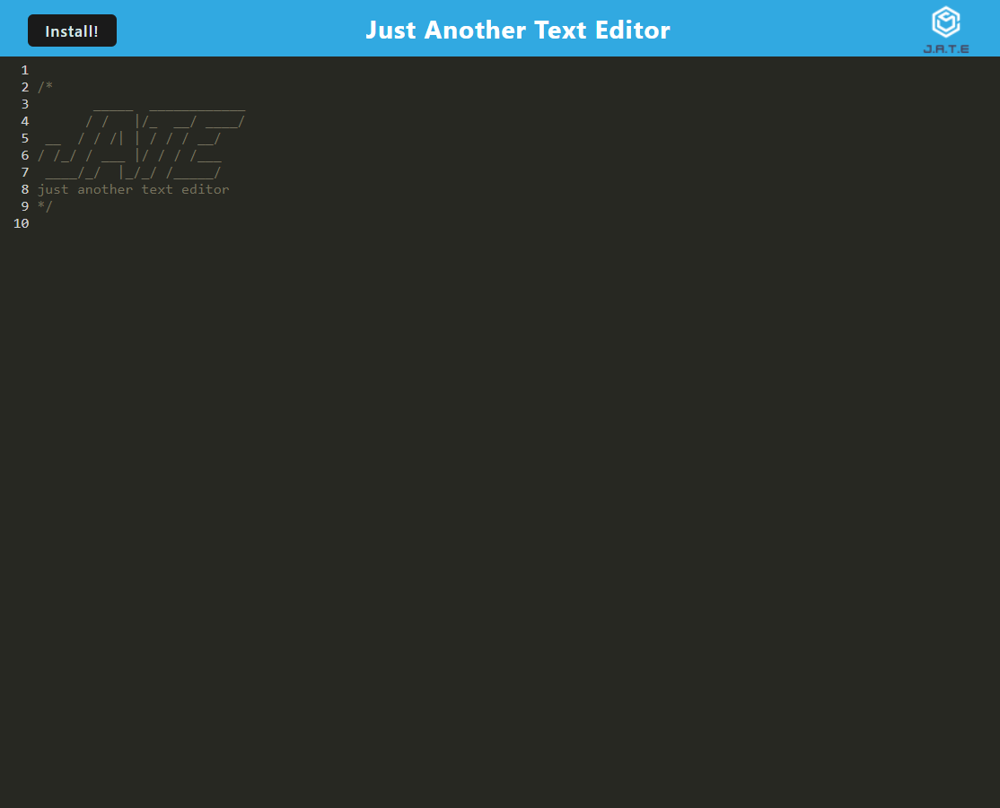

# Text-Editor


## Description:
Text Editor is a single page web application that meets the PWA criteria, it is able to store persistant data as well as run offline.

## Table of Contents:
* [Installation](#installation)
* [Usage](#usage)
* [Deployed Link](#deployedlink)
* [License](#license)
* [Contributing](#contributing)
* [Tests](#tests)
* [Questions](#questions)

### Installation:
```bash
git clone https://github.com/Samualjensen/Text-Editor.git
```
```bash
npm i
 ```
Then run: 
```bash
npm run start:dev
 ``` 

### Usage:
Once you have completed the steps listed above run:
```bash
npm run start
```
To run this locally on your machine open Insomnia use http://localhost:3000/.

### Deployed Link:
https://cryptic-reef-18857.herokuapp.com/

### License
[MIT License](https://opensource.org/licenses/MIT)
### Contributing
1. **Fork** the repo on GitHub.
2. **Clone** the project to your own machine.
3. **Commit** changes to your own branch.
4. **Push** your work back up to your fork.
5. Submit a **Pull request** so that your changes can reviewed.

### Tests
N/A

### Questions
My Github profile can be found at [Github](https://github.com/Samualjensen), or contact Sam Jensen at samual.jensen@gmail.com.